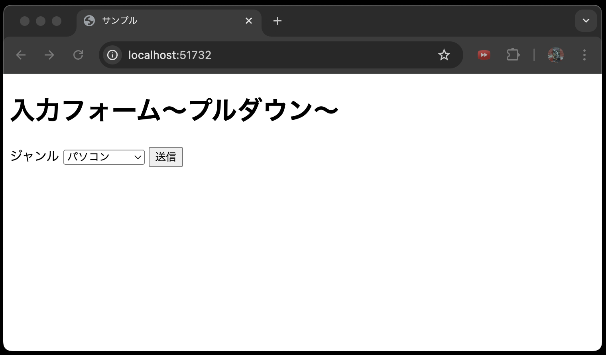

# ルーティングについて

Laravelにおけるルーティングとは、URLとアプリケーション内の特定のロジックをマッピングすることを指します。

ここでいうマッピングとは、特定のURLにアクセスしたときにどのビューやコントローラを呼び出すかを定義することです。(※コントローラについては別の章で後述します。)

ルーティングを定義するメリットは、アプリケーションのURL構造を簡潔に保ち、**コードの可読性を向上させることができる**点です。
ただし、可読性の向上について実感できるのは、後期授業が進み、扱うPHPファイルが増えたときになりますのでしばしお待ちを。

では、Laravelのルーティングを定義する方法を見ていきましょう。
ルーティングを定義する `routes/web.php` ファイルを以下のように書き換えましょう。

**routes/web.php**

```php
<?php

use Illuminate\Support\Facades\Route;

// デフォルトのルート設定はコメントアウトしてください
// Route::get('/', function () {
//     return view('welcome');
// });

Route::get('/', function () {
    return view('index');
})->name('index');
```

**【解説】**

`Route`: `Route`クラスは、Laravelのルーティングを定義するためのクラスです。

`Route::get`:<br> 
`Route::get`メソッドは、`GET`リクエストを処理するためのルートを定義します。(※PHPでは、前期授業で述べた通り、何も指定しなければリクエスト時に使用されるメソッドは`GET`リクエストです。)

`Route::get`メソッドの第1引数は、URLを指定します。
上記の例では、`/` となっています。
第2引数は、クロージャです。
クロージャは、指定されたURLにアクセスされたときに実行される処理を定義します。
Laravelでは、クロージャを使って、ルートに直接ロジックを記述することができます。

上記の例では、`return view('index');` は、`index.blade.php`ビューを返す処理を定義しています。
また、`->name('index')` は、このルートに名前を付けるためのメソッドです。
名前を付けることで、ビューなどからルートを参照する際に、URLを直接記述するのではなく、名前を使って参照することができ便利です。

ここまでプログラムが作成できたら、ブラウザでアクセスしてみましょう。
以下のような画面が表示されればOKです。



なぜこの画面が表示されるのか、理由を考えてみましょう。

それは、`Route::get('/', function () { return view('index'); })->name('index');` で、`/` にアクセスしたときに、`index.blade.php` ビューを返すように**マッピングしているから**です。

## まとめ

今回学んだ内容は、Laravelの基本的な機能であるビュー、Bladeテンプレート、そしてルーティングの使い方について紹介しました。

次回以降の授業では、コントローラの使い方やデータベースとの連携について学びます。
